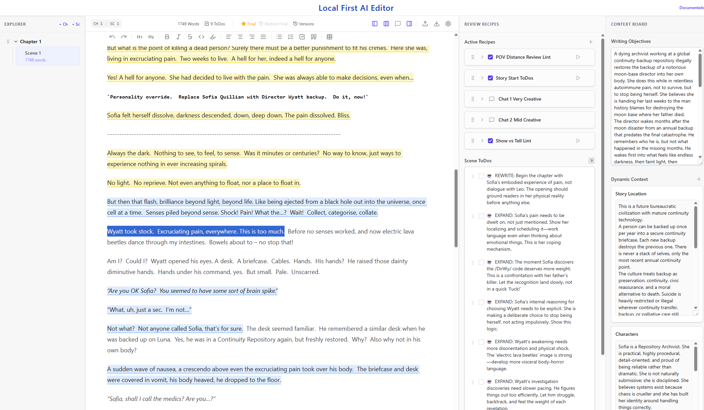

# User Guide — Local First Editor with AI Reviewer

This guide explains how to use the application as a writer. It covers the full workflow from creating your manuscript to running AI reviews, managing versions, and exporting your work.

---

## Table of Contents

1. [Overview](#overview)
2. [Getting Started](#getting-started)
3. [The Layout](#the-layout)
4. [Chapters and Scenes](#chapters-and-scenes)
5. [The Writing Canvas](#the-writing-canvas)
6. [AI Recipes](#ai-recipes)
   - [Chat Recipes](#chat-recipes)
   - [Lint Recipes](#lint-recipes)
   - [ToDo Recipes](#todo-recipes)
7. [Scene ToDos](#scene-todos)
8. [The Context Board](#the-context-board)
9. [Versioning](#versioning)
10. [Exporting Your Work](#exporting-your-work)
11. [Importing Your Work](#importing-your-work)
12. [Settings & AI Profiles](#settings--ai-profiles)

---

## Overview

This is a **privacy-first, browser-native writing application**. It is designed to help you improve your own writing, not generate it for you. The AI acts as a semantic linter — it critiques your prose, highlights weak passages, flags inconsistencies, and generates structured notes. Your manuscript text only leaves your machine when you explicitly run an AI review.

Everything is saved automatically in your browser's local storage (IndexedDB). There is no account, no cloud sync, and no server required.

## Status

This project is **ALPHA** 

- it *should* allow you to paste in a story from word or html (markdown to html not tested).
- it *will* allow you to setup openrouter, ollama or other local llm, or openai (for anthropic use openrouter)
- it *will* allow you to add and remove chapters (be careful, it might noot warn on deletion)
- it *will* allow you to create writing review recipes
- these recipes *should* allow the AI model to review content and make suggestions.
- these recipes *are not intended* to do the writing for you (but up to you if you want to use AI output)
- versioning *will* allow you to create versions of your document including recipes, context, and chat
- output *should* output settings and story and versions chapters history etc without disclosing your AI tokens
- input *may* import your story into a fresh browser

---

## Editor Working View

---

## Getting Started

### First Launch

When you first open the app, a default project is created with a single scene. You can immediately start writing in the central editor or paste your story in from Word, possibly clean HTML or markdown.

### Setting Up AI

Before running any AI review, you need to configure at least one AI provider:

1. Click the **Settings** gear icon in the top toolbar.
2. Under **Provider Profiles**, add or edit your provider (OpenAI, OpenRouter, Ollama, or any OpenAI-compatible endpoint).
3. Enter your **API Key** and **Base URL**.
4. Under **Tier Configuration**, assign each tier (Fast / Balanced / Deep) to a provider and model.

Tiers let you route different recipes to different models — for example, a fast local Ollama model for spelling checks and a deeper cloud model for narrative critique.

---

## The Layout

The app uses a four-column layout designed for ultrawide monitors. On smaller screens, the side panels collapse into toggleable drawers.

| Column | Panel | Purpose |
|--------|-------|---------|
| Far Left | Explorer | Chapter and scene navigation |
| Center Left | Canvas | The Tiptap writing editor |
| Center Right | Review | AI recipe cards + Scene ToDos |
| Far Right | Context Board | Writing Objectives + dynamic context cards |

Use the toggle buttons in the header toolbar to show or hide each panel.

---

## Chapters and Scenes

Your project is organised into **Scenes**, each belonging to a **Chapter**.

### Creating a Scene

1. In the **Explorer Panel** (far left), click **+ Add Scene**.
2. You can optionally copy the **Recipes** and/or **Context** from the current scene into the new one.
3. The new scene appears in the scene list and becomes the active scene.

### Navigating Scenes

Click any scene in the Explorer Panel to switch to it. The editor, recipes, ToDos, context board, and version strip all update to reflect that scene.

### Renaming a Scene

Click directly on the scene title in the Explorer Panel to edit it inline.

### Scene Numbering

Scenes are automatically numbered by chapter and scene (e.g. Ch 1 / Sc 2). This numbering is used to generate file names on export.

---

## The Writing Canvas

The center-left column is a full-featured rich text editor (Tiptap/ProseMirror).

### Formatting

The toolbar above the canvas provides standard formatting controls:

- **Inline:** Bold, Italic, Underline, Strikethrough, Code, Text Highlight
- **Block:** Headings (H1–H3), Blockquote, Code Block
- **Lists:** Bullet List, Ordered List, Task List (checkboxes)
- **Alignment:** Left, Center, Right, Justify
- **Tables:** Insert and edit tables
- **History:** Undo and Redo

Standard Markdown shortcuts also work as you type (e.g. `**bold**`, `# Heading`, `- list item`).

### Word Count

The current word count for the active scene is shown in the header toolbar and updates in real time.

---

## AI Recipes

**Recipes** are the core of the AI review system. Each recipe is an instruction card that tells the AI what to look for and how to return its findings. You can have as many recipes as you need and toggle them on or off independently.

Recipes live in the **Review Panel** (center right), in the **Active Recipes** section.

### Creating a Recipe

Click **+ Add Recipe** at the bottom of the Active Recipes section. A new card is created with default settings. Edit the **Title** and **Prompt** fields directly on the card.

#### Recipe Types

- chat: create a chat discussion (give it a name like "review story opening") and click chat button for a chat column
- lint: give it a colour and name (like check POV) and input your recipe prompt and it will highlight that colour where the recipe has advice to give
- todo: create todo items with the recipe prompt.  This doesn't highlight text but gives you a list of todos.

### Running a Recipe

Click the **Run** (▷ play) button on any recipe card. The AI will receive:
- Your recipe prompt
- The active scene text
- Your Writing Objectives and active Context Board items

Results appear on the card in real time.

### Recipe Settings

Expand a recipe card to access advanced settings:

| Setting | Description |
|---------|-------------|
| **Active toggle** | Switch the recipe on/off (off = excluded from runs) |
| **Tier** | Fast / Balanced / Deep — determines which AI model is used |
| **Temperature** | Controls AI randomness (0.0 = deterministic, 1.0 = creative) |
| **Max Tokens** | Optional hard cap on response length |
| **Output Format** | Chat, Lints, or ToDos (see below) |
| **Highlight Color** | Color used to mark text in the editor for Lint recipes |

### Reordering Recipes

Hover over a recipe card to reveal the **grip handle** (⠿) on the left. Drag it to reorder the recipe in the list.

---

### Chat Recipes

**Output format: Chat**

Chat recipes open a conversational panel. You type a message and the AI responds in a thread, maintaining the full conversation history. The active scene text is always passed as context.

Use Chat recipes for open-ended exploration: asking the AI to explain a passage, discuss plot implications, or brainstorm alternatives.

- Chat history is preserved per recipe, per version.
- Click the recipe header to open or close the chat panel.

---

### Lint Recipes

**Output format: Lints**

Lint recipes return structured feedback anchored to specific passages in your text. When the AI responds, it returns a list of issues, each containing:
- The **original text** to highlight
- A **commentary** (the critique)
- An optional **reasoning** note

The app automatically highlights the `original_text` in the editor using the recipe's chosen **highlight color**. The lint card in the sidebar is styled to match that color.

**Actions on a Lint Card:**

| Button | Effect |
|--------|--------|
| **Add to ToDos** | Converts the lint into a Scene ToDo, keeping the same color and preserving the editor highlight |
| **Ignore** | Removes the editor highlight and dismisses the lint card |

---

### ToDo Recipes

**Output format: ToDos**

ToDo recipes ask the AI to generate a list of actionable items (things to fix or consider) rather than anchored critiques. The AI response is parsed and each item is added directly to the **Scene ToDos** list below the recipes.

Use ToDo recipes for broad editorial notes: "what are the three biggest structural issues with this scene?"

---

## Scene ToDos

The **Scene ToDos** section sits below the Active Recipes in the Review Panel. It is a simple task list scoped to the current scene and version.

### Adding a ToDo

Type in the input field at the bottom of the ToDos section and press **Enter**. If you have text selected in the editor when you press Enter, that selection is automatically highlighted in **gray** and linked to the new ToDo.

### ToDo Colors

- ToDos created manually without a selection have no background color.
- ToDos created with an editor selection are shown with a **gray** background and maintain the gray highlight in the editor.
- ToDos copied from a **Lint card** inherit that lint's recipe color (yellow, red, blue, etc.) and keep the existing highlight in the editor.

### Completing and Ignoring

- **Checkbox**: Marks the ToDo as completed. If the ToDo has a linked editor highlight, that highlight is removed when completed.
- **Ignore button**: Marks the ToDo as ignored (shown with strikethrough). The editor highlight is also removed.
- **Delete button**: Permanently removes the ToDo from the list.

### Reordering ToDos

Hover a ToDo to reveal the **grip handle** on the left. Drag to reorder.

---

## The Context Board

The **Context Board** (far right panel) provides persistent context that is included in every AI recipe run. It has two parts.

### Writing Objectives

A free-text area at the top where you describe the **goals of the current scene** — what you want the reader to feel, what plot points need to land, what tone you're going for. This is always passed to the AI.

### Dynamic Context Cards

Below Writing Objectives, you can add as many context cards as you need. Each card has an editable **Title** and a **Content** body. Common uses include:

- **Characters** — names, descriptions, voices, relationships
- **Locations** — setting details, atmosphere
- **Lore / Rules** — magic systems, world rules, technology
- **Story So Far** — a brief summary for the AI to understand the wider narrative

Click **+ Add Context** to create a new card. Cards can be renamed, edited, and deleted at any time.

> **Tip:** The more specific your context cards, the better the AI's critiques. A "Character: Elara" card with voice notes produces far better dialogue feedback than a generic character description.

---

## Versioning

Every scene supports **named versions**. You can maintain multiple drafts of the same scene and switch between them freely.

### The Version Strip

The version strip is the horizontal bar that appears just below the main header toolbar, above the writing canvas. It shows all versions for the currently active scene.

### Creating a Version

Click **+ New Version** in the version strip. A new version is created as a **full clone** of the current version, including:
- The full manuscript text
- The complete ToDo list
- All recipes (with cleared feedback and chat history)
- All context items

### Switching Versions

Click any version tab in the strip to switch to it. The editor, recipes, ToDos, context board, and all AI history update immediately.

### Renaming a Version

Click the name in the active version tab (the blue one) and type directly to rename it.

### Marking Final Output

Each version has a **star (★) button**. Click it to mark that version as the **Final Output**. Only one version per scene can be Final Output at a time. Clicking the star again removes the marker.

The Final Output version is used by the exporter when writing the `Story/` files — it represents the canonical manuscript. If no version is marked as final, the currently active version is used instead.

### Deleting a Version

Click the **trash icon** on any version tab to delete it. You cannot delete a scene's last remaining version.

---

## Exporting Your Work

Click the **Export** button in the header toolbar (folder icon with down arrow) to open the Export dialog.

### Export Options

You choose which categories to export by ticking checkboxes:

| Category | Folder | Contents |
|----------|--------|----------|
| **Whole Story** | `/Story/` | Final Output (or active) version of every scene as `.md` files with YAML frontmatter |
| **Current Scene** | `/Scene/` | Active version of the currently open scene only |
| **All Versions** | `/Version/` | Every version of every scene |
| **Recipes** | `/Recipe/` | Recipe configs (title, prompt, tier, temperature, etc.) per scene |
| **Todos** | `/Todo/` | Open and ignored todos per scene |
| **Context Board** | `/Context/` | Writing Objectives + context items per scene |
| **Chat Histories** | `/History/Chat/` | Full conversation per chat recipe |
| **Lint Histories** | `/History/Lint/` | Anchored lint findings per recipe |
| **Completed Todos** | `/History/Todo/` | Completed todos per version |
| **Settings** | `/Settings/` | AI provider profiles and tier configuration (includes API keys — keep this folder private) |

### How to Export

1. Click **Export** in the header.
2. Tick the categories you want.
3. Click **Export to Folder**.
4. Choose a destination folder in your OS file picker.
5. The app writes the files directly into that folder.

All text files use **YAML frontmatter** (metadata at the top) so they are readable as plain Markdown and importable back into the app.

---

## Importing Your Work

Click the **Import** button in the header toolbar (folder icon with up arrow) to open the Import dialog.

### Import Modes

| Mode | Behaviour |
|------|-----------|
| **Overwrite** | Merges imported data into the existing project, updating matching scenes and versions in place |
| **Start Fresh** | Wipes the current project entirely before importing |

### How to Import

1. Click **Import** in the header.
2. Select the import mode (**Overwrite** or **Start Fresh**).
3. Click **Pick Folder** and select the previously exported folder.
4. The app scans the folder and shows a **findings summary** — how many files were found per category.
5. Uncheck any categories you do not want to import.
6. Click **Import** to complete.

The importer reconstructs all data types, including converting Markdown text back into the Yjs document format used by the editor.

> **Note:** Import and Export require the **File System Access API**, which is supported in Chromium-based browsers (Chrome, Edge, Arc, Brave). It is not available in Firefox.

---

## Settings & AI Profiles

Open Settings via the gear icon in the header.

### Provider Profiles

Each profile represents an AI endpoint:

| Field | Description |
|-------|-------------|
| **Name** | A display label for the profile |
| **API Key** | Your key for the endpoint |
| **Base URL** | The endpoint URL (must be OpenAI-compatible `/v1/chat/completions`) |
| **Default Model** | The default model ID for this provider |

The app ships with three pre-configured profiles as templates: OpenAI, OpenRouter, and Ollama (local). You can add, edit, or delete profiles freely.

### Tier Configuration

Tiers (Fast / Balanced / Deep) map to a specific provider profile and model. Each recipe has a Tier setting, which determines which model processes that recipe.

A typical setup might be:
- **Fast** → Ollama (local) for quick checks like typos and grammar
- **Balanced** → OpenAI GPT-4o-mini for style and pacing notes
- **Deep** → OpenRouter Claude 3.5 Sonnet for full narrative critique

Settings are stored in your browser's `localStorage` and are not synced across devices unless you export and import your Settings file.

---

_For development setup, build commands, and architecture information, see [README.md](README.md) and [CLAUDE.md](CLAUDE.md)._
